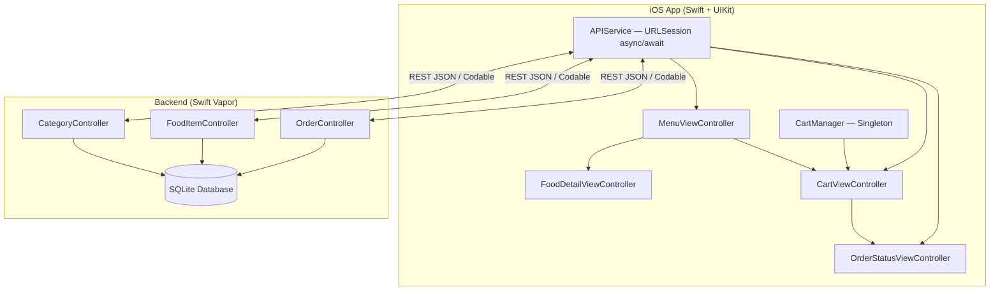

# 🍔 Biteflow — Full-Stack Swift Project Overview

## Architecture



## Project Structure

```text
Biteflow/
├── backend/                              # Swift Vapor REST API Server
│   ├── Package.swift                     # Dependencies: Vapor, Fluent, SQLite
│   ├── Sources/App/
│   │   ├── entrypoint.swift              # @main async entry
│   │   ├── configure.swift               # DB, CORS, migrations, server config
│   │   ├── routes.swift                  # /api/v1 route registration
│   │   ├── Models/
│   │   │   ├── Category.swift            # Fluent model
│   │   │   ├── FoodItem.swift            # Fluent model with dietary tags
│   │   │   ├── Order.swift               # Fluent model + OrderStatus enum
│   │   │   └── OrderItem.swift           # Junction model (order ↔ food item)
│   │   ├── Controllers/
│   │   │   ├── CategoryController.swift  # GET categories, with-items
│   │   │   ├── FoodItemController.swift  # GET items, featured, search
│   │   │   └── OrderController.swift     # POST/GET orders, PATCH status
│   │   ├── Migrations/                   # Schema + seed data
│   │   └── DTOs/
│   │       └── OrderDTO.swift            # Request/Response transfer objects
│   └── Tests/AppTests/
│
└── iOS/                                  # Native Swift + UIKit iOS App
    └── BiteflowApp/
        ├── App/
        │   ├── AppDelegate.swift         # Global appearance config
        │   └── SceneDelegate.swift       # Tab bar setup (Menu, Cart, Orders)
        ├── Models/                       # Codable structs mirroring backend
        ├── Controllers/
        │   ├── MenuViewController.swift          # 2-col grid + category pills + search
        │   ├── FoodDetailViewController.swift    # Hero image + meta cards + add to cart
        │   ├── CartViewController.swift          # Item list + pricing + checkout
        │   └── OrderStatusViewController.swift   # Order history + pull-to-refresh
        ├── Views/
        │   ├── FoodCardCell.swift         # Rich card with image, badges, rating
        │   ├── CategoryPillCell.swift     # Horizontal filter pills
        │   └── CartItemCell.swift         # Stepper + delete controls
        ├── Networking/
        │   └── APIService.swift           # URLSession client (all endpoints)
        ├── Managers/
        │   └── CartManager.swift          # Singleton cart state + NotificationCenter
        ├── Extensions/
        │   ├── Theme.swift                # Design system (colors, fonts, shadows)
        │   └── UIView+Constraints.swift   # AutoLayout helpers
        └── Resources/
            └── Info.plist                 # ATS, scene manifest, orientation
```

## API Endpoints

| Method | Endpoint | Description |
|--------|----------|-------------|
| `GET` | `/` | Health check |
| `GET` | `/api/v1/categories` | All categories |
| `GET` | `/api/v1/categories/with-items` | Categories with nested food items |
| `GET` | `/api/v1/categories/:id` | Single category with items |
| `GET` | `/api/v1/items` | All available food items |
| `GET` | `/api/v1/items/featured` | Top-rated items (≥ 4.7★) |
| `GET` | `/api/v1/items/search?q=` | Search by name/description |
| `GET` | `/api/v1/items/:id` | Single food item detail |
| `POST` | `/api/v1/orders` | Place a new order |
| `GET` | `/api/v1/orders` | List all orders |
| `GET` | `/api/v1/orders/:id` | Order detail with items |
| `PATCH` | `/api/v1/orders/:id/status` | Update order status |
| `DELETE` | `/api/v1/orders/:id` | Cancel an order |

## Seeded Menu Data

**6 Categories** with **17 Food Items** including:
- 🍔 Burgers (4 items) — Classic Smash, Truffle Mushroom, Spicy Jalapeño, Beyond Garden
- 🍕 Pizzas (4 items) — Margherita, Pepperoni, BBQ Chicken, Four Cheese
- 🥗 Salads (2 items) — Caesar, Mediterranean
- 🍝 Pasta (2 items) — Carbonara, Arrabbiata
- 🍰 Desserts (2 items) — Lava Cake, Cheesecake
- 🥤 Drinks (3 items) — Mango Smoothie, Iced Latte, Lemonade

## Next Steps to Run This Project

> [!IMPORTANT]
> Since the iOS app requires Xcode (macOS), you need **one** of these to compile and test:
> 1. **Cloud Mac** (MacInCloud, ~$1/hr) — remote desktop into Xcode
> 2. **macOS VM** on your Windows PC (VMware/OSX-KVM)

### Running the Vapor Backend (on Windows)
```bash
# Install Swift for Windows from https://www.swift.org/install/windows/
cd Biteflow/backend
swift run
# Server starts on http://localhost:8080
```

### Running the iOS App (on Mac/VM)
1. Open `iOS/BiteflowApp/` in Xcode
2. Create a new Xcode project, add all Swift files to the target
3. Set the `baseURL` in `APIService.swift` to your backend's address
4. Hit `Cmd + R` → runs on iOS Simulator
