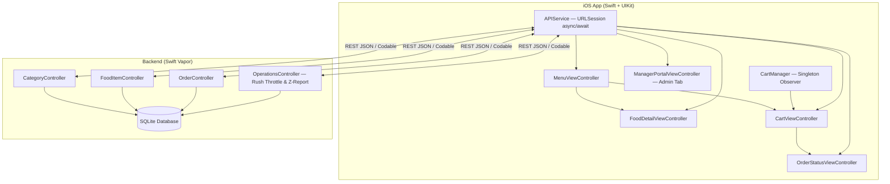

# 🍔 Biteflow — Full-Stack Food Ordering & Restaurant Management Platform

A high-performance, full-stack food delivery and restaurant management system built entirely in **Swift**. Featuring a native **iOS client in programmatic UIKit** and a lightweight, asynchronous **REST API server powered by Swift Vapor 4, Fluent ORM, and SQLite**.

---

## 🏛️ Architecture



---

## ⚡ Restaurant Management & Operations Features

### 1. 🍽️ Smart Dine-In Mode with QR Table Ordering & Tab Splitting
* **Dining Modes:** Toggle seamlessly between **Dine-In**, **Takeout**, and **Delivery**.
* **Table Identification:** Assign orders directly to a specific dining table (e.g., *Table 4*).
* **Live Bill-Splitting Engine:** Built-in calculator allows parties of 1 to 8 guests to split tickets evenly, showing a real-time **per-person cost breakdown** ($XX.XX / guest).
* **Automated Delivery Waiver:** Automatically zeroes out delivery fees on all dine-in and pickup tickets.

### 2. ⚡ Real-Time "86'd" (Item Sold Out) Instant Toggle & Low-Stock Alerts
* **One-Tap Availability Toggle:** Restaurant managers can instantly 86 (mark out of stock) any dish across all active customer devices in real-time.
* **Visual Status Overlays:** Sold-out items immediately render an **"86'D · SOLD OUT"** badge, dimmed card transparency, and disabled order buttons.
* **Scarcity Indicators:** Automated **"🔥 Only X Left!"** badges activate when remaining inventory drops to 5 units or fewer.

### 3. ⏱️ Kitchen "Rush Hour" Throttle & Dynamic Prep Times
* **Peak-Rush Protection:** Kitchen managers can activate a **Peak Rush Throttle** during heavy ticket volume.
* **Customer Notice:** Displays an animated **"🔥 Kitchen Rush Active"** notification banner across the customer menu feed.
* **Dynamic Time Padding:** Automatically adds +15 minutes to estimated preparation and wait times across all menu items.

### 4. 🍷 Smart Upsell & Course Pairing Engine (Boosts Average Order Value)
* **Chef's Curated Pairings:** Food detail views feature an intelligent recommendation card (e.g., *Wine Pairing* or *Signature Sides*) with 1-tap addition to the ticket.
* **In-Cart Completion Strip:** A 1-tap quick-add bar right above the checkout button prompts guests to add high-margin desserts (*Tiramisu*) or beverages (*Double Espresso*).

### 5. 📊 Real-Time Daily "Z-Report" & Shift Operations Dashboard
* **Manager Dashboard Tab:** Dedicated 4th navigation tab providing complete executive shift visibility.
* **Live Operational KPIs:** Instant metrics for **Gross Revenue**, **Total Ticket Count**, **Average Ticket Size**, and **Active Kitchen Queue**.
* **Shift Breakdown:** Detailed volume counts across Dine-In, Takeout, and Delivery channels, alongside net revenue and tax totals.
* **Top 5 Bestselling Dishes:** Ranked dish leaderboard tracking unit sales and item revenue.
* **Live Inventory Controls:** Quick-access switchboard to toggle item availability on the fly.

---

## 📁 Project Structure

```text
Biteflow/
├── backend/                              # Swift Vapor REST API Server
│   ├── Package.swift                     # Dependencies: Vapor, Fluent, SQLite
│   ├── Sources/App/
│   │   ├── entrypoint.swift              # @main async application entry
│   │   ├── configure.swift               # DB, CORS, migrations, server config
│   │   ├── routes.swift                  # /api/v1 route registration
│   │   ├── Models/
│   │   │   ├── Category.swift            # Fluent category model
│   │   │   ├── FoodItem.swift            # Food model (86'd status, stock, pairings)
│   │   │   ├── Order.swift               # Order model (diningOption, tableNumber, splitCount)
│   │   │   └── OrderItem.swift           # Relational junction model (order ↔ item)
│   │   ├── Controllers/
│   │   │   ├── CategoryController.swift  # GET categories, with-items
│   │   │   ├── FoodItemController.swift  # GET items, search, PATCH toggle-86, stock, upsells
│   │   │   ├── OrderController.swift     # POST/GET orders, auto-inventory decrement
│   │   │   └── OperationsController.swift # GET status, POST rush-mode, GET z-report
│   │   ├── Migrations/                   # Database schemas & comprehensive seed data
│   │   └── DTOs/
│   │       ├── OrderDTO.swift            # Request & response transfer objects
│   │       └── OperationsDTO.swift       # Operations status, Z-Report, top dishes DTOs
│   └── Tests/AppTests/                   # Integration smoke tests
│
└── iOS/                                  # Native Swift + UIKit iOS App
    └── BiteflowApp/
        ├── App/
        │   ├── AppDelegate.swift         # Global theme & appearance configuration
        │   └── SceneDelegate.swift       # 4-tab coordinator (Menu, Cart, Orders, Manager)
        ├── Controllers/
        │   ├── MenuViewController.swift  # Compositional layout grid, search, rush banner
        │   ├── FoodDetailViewController.swift # Hero display, pairing card, 86'd handling
        │   ├── CartViewController.swift  # Dining mode selector, bill splitter, upsells
        │   ├── OrderStatusViewController.swift # Real-time order tracking & refresh
        │   └── ManagerPortalViewController.swift # Live Z-Report, Rush switch, 86 manager
        ├── Models/
        │   ├── Category.swift
        │   ├── FoodItem.swift
        │   ├── CartItem.swift
        │   ├── Order.swift
        │   └── OperationsModels.swift
        ├── Views/
        │   ├── FoodCardCell.swift        # Menu card with 86'd badge & low stock pill
        │   ├── CartItemCell.swift
        │   └── CategoryPillCell.swift
        ├── Managers/
        │   └── CartManager.swift         # Observer pattern, dining mode, bill splitting
        ├── Networking/
        │   └── APIService.swift          # URLSession async/await client with PATCH support
        ├── Extensions/
        │   └── UIView+Layout.swift       # AutoLayout DSL constraint helpers
        └── Resources/
            ├── Theme.swift               # Design tokens, typography & adaptive colors
            └── Info.plist
```

---

## 🌐 API Specification

| Method | Endpoint | Description |
|---|---|---|
| `GET` | `/api/v1/categories` | List all menu categories |
| `GET` | `/api/v1/categories/with-items` | Fetch categories with nested menu items |
| `GET` | `/api/v1/items` | Fetch all menu items with real-time 86'd status |
| `GET` | `/api/v1/items/featured` | Top-rated menu items (rating ≥ 4.7) |
| `GET` | `/api/v1/items/search?q={query}` | Search menu items by title or description |
| `GET` | `/api/v1/items/:id/upsells` | Fetch recommended complementary pairings & sides |
| `PATCH` | `/api/v1/items/:id/toggle-86` | Instantly toggle 86'd (sold-out) item availability |
| `PATCH` | `/api/v1/items/:id/stock` | Update item stock count with auto-86 threshold |
| `POST` | `/api/v1/orders` | Place order (supports dine-in, takeout, delivery) |
| `GET` | `/api/v1/orders` | List order history |
| `GET` | `/api/v1/orders/:id` | Retrieve specific order details with itemized ticket |
| `GET` | `/api/v1/operations/status` | Real-time kitchen load, rush status & active ticket count |
| `POST` | `/api/v1/operations/rush-mode` | Manager toggle for kitchen peak rush throttle |
| `GET` | `/api/v1/operations/z-report` | Daily shift Z-Report, gross revenue, & top dishes |
